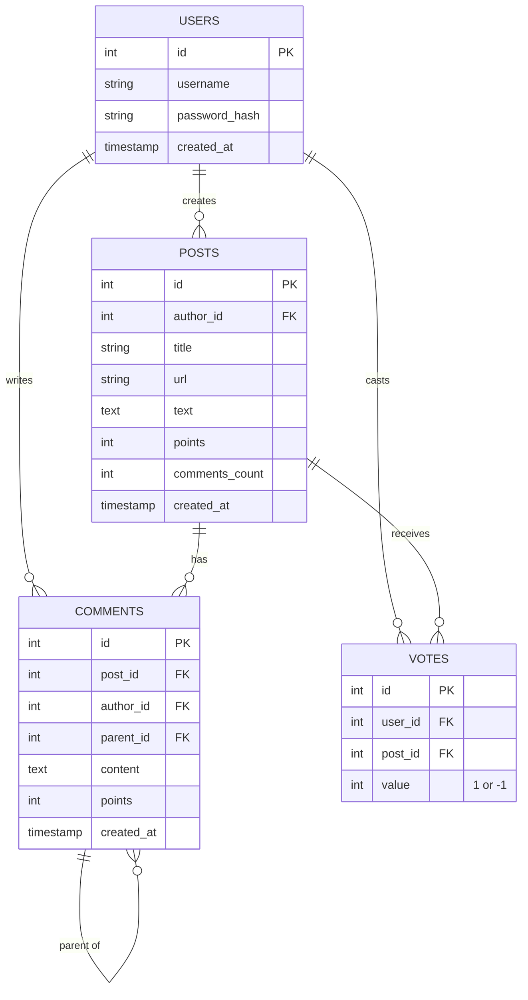

# Architecture

## High Level Design
```mermaid
graph TD
    User[User Client] -->|HTTP/REST| LB[Load Balancer / Nginx (Optional)]
    LB -->|HTTP| API[Backend API (Node.js/Express)]
    API -->|SQL| DB[(PostgreSQL)]
    
    subgraph "Apps"
        Frontend[React Frontend]
        Backend[Express Backend]
    end
    
    Frontend -->|Requests| Backend
    Backend -->|Queries| DB
```

## Low Level Design (ERD)


## Key Flows
1. **Login**: POST /auth/login -> Returns JWT. Frontend stores in Context/LocalStorage.
2. **Create Post**: POST /posts (Auth required).
3. **Add Comment**: POST /posts/:id/comments (Auth required). Recursive structure.

## Directory Structure
- `apps/backend`:
  - `src/api`: Routes and Controllers.
  - `src/core`: Business logic / Services.
  - `src/db`: Knex migrations/seeds over Models.
- `apps/frontend`:
  - `src/components`: Reusable UI.
  - `src/pages`: Route pages.
  - `src/context`: Global state (Auth).
